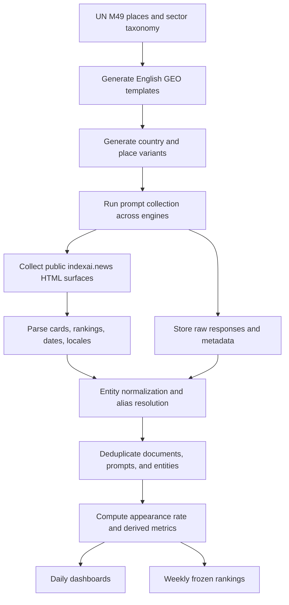
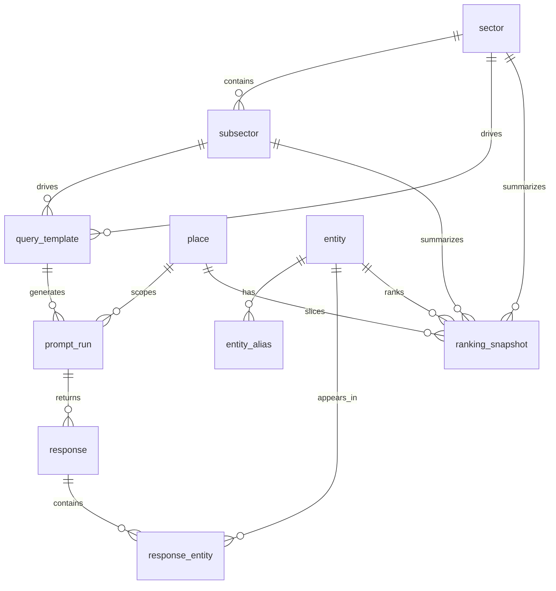

# GEO Ranking Sector Monitoring for indexai.news

## Executive summary

The strongest first-wave GEO Ranking page for indexai.news should focus on sectors where AI answers are already shaping high-consideration decisions, where brands are distinct entities, and where country and place context materially changes who gets mentioned. The current public surfaces reviewed show indexai.news tracking **4.2 million queries per week** across **127 sectors**, with a weekly **Ainalytics** AI Visibility Index that blends citation frequency, average position, and sentiment across major generative engines. Its own research says comparative prompts diverge most from traditional search, and explicitly highlights **banks, health plans, and universities** as early decision categories where chatbot adoption is rising fast. citeturn25search2turn29view0turn40view0

I therefore recommend a first production taxonomy of **10 sectors**: Financial Services, Healthcare, Education, Retail and E-commerce, Travel and Hospitality, Consumer Brands with Fashion and Beauty, Technology with Software and Telecom, Real Estate and Housing, Automotive and Mobility, and Food with Grocery and Restaurants. This list is an applied GEO taxonomy, not a pure industrial taxonomy. It is grounded in the globally portable structure of the entity["organization","United Nations Statistics Division","statistics office"] ISIC classification, then narrowed to categories that are especially comparison-heavy and place-sensitive in AI use. citeturn43view5turn40view0

The public evidence also supports starting with **English templates but not an English-only system**. indexai.news currently runs multi-locale public pages, and its own research coverage reports materially different answer patterns by language, with a homepage snippet stating that Spanish prompts generate **34% more response variance than English**. In production, English should remain the canonical template language, but every important query family should also have locale-native mirrors. citeturn1view0turn29view0turn20view2turn25search2

A practical constraint matters. In the public pages I reviewed, indexai.news exposes homepages, category pages, article pages, and ranking cards, and its footer advertises tools including an API. But the accessible public landing pages reviewed did **not** expose documented API endpoints, quotas, or raw response-count fields. So the right design is a **two-layer system**: a conservative public-surface crawler now, plus an adapter that can ingest ranking or response endpoints later if public documentation or stable network calls become available. citeturn1view0turn6view0turn40view0turn36view0

## Evidence base and prioritization logic

The case for a GEO ranking page is not abstract. indexai.news’s current research says that **68%** of generated answers in its January to April 2026 study did not cite Google’s top ten organic results, and **41%** cited sources outside the top 100. The same article says comparative prompts are the most divergent bucket and that brands with strong presence in specialist media, academic papers, and structured databases benefit disproportionately. That is exactly the environment where a sector-by-sector ranking page is useful. citeturn40view0

The sector choice also fits what AI products themselves are now optimizing for. Official entity["company","OpenAI","ai company"] help documentation says that when a prompt has shopping intent, ChatGPT Search can show products with imagery, details, and links to purchase pages. Official entity["company","Google","technology company"] Search documentation says AI Mode can build trip plans including flights and hotels, local attractions, and iterative follow-up refinements. Those product directions reinforce the importance of retail, travel, and place-sensitive recommendation categories. citeturn43view1turn43view0

The place model should be globally standardized from the start. The UN M49 standard gives stable country and area identities, and the same UN page notes that ISO alpha codes represent country “name” identity while M49 codes represent “statistical” identity. That is useful for a GEO ranking page because country names can change, aliases can drift, and regional grouping matters. citeturn43view4

### Recommended first-wave sector set

| Sector | Priority | Why it belongs in wave one | Core subsectors |
|---|---:|---|---|
| Financial Services | Very high | Explicitly visible on current public leaderboards and directly named in indexai.news research as a high-consideration AI decision area | Banks, Neobanks/Fintech, Insurance, Payments/Wallets, Wealth/Investing |
| Healthcare | Very high | Directly named in research, and health queries are cited in current rollout coverage | Hospitals, Health Plans, Telehealth, Pharma Brands, Labs/Diagnostics |
| Education | Very high | Directly named in research as a high-consideration AI decision area | Universities, Business Schools, Online Learning, K-12/International Schools, Vocational/Bootcamps |
| Retail and E-commerce | High | Current public snippets already show e-commerce rankings, and AI products now explicitly optimize for shopping intent | Marketplaces, Grocery E-commerce, Electronics Retail, Home Goods, Pharmacy Retail |
| Travel and Hospitality | High | Official AI products now generate itineraries, flight and hotel options, and localized travel choices | Hotels, Airlines, OTAs/Metasearch, Vacation Rentals, Tours/Experiences |
| Consumer Brands with Fashion and Beauty | High | Current public case coverage already points to sustainable cosmetics and sustainable fashion recommendation dynamics | Beauty/Cosmetics, Luxury Fashion, Apparel/Fast Fashion, Sportswear, Jewelry/Watches |
| Technology with Software and Telecom | High | AI products increasingly mediate software discovery, tech support, and device or operator selection | AI Platforms, Cloud, Cybersecurity, SaaS, Mobile Operators |
| Real Estate and Housing | Medium high | Highly place-sensitive, high LTV, comparison-heavy, and entity-rich | Developers, Portals, Brokerages, Coworking, Rental Platforms |
| Automotive and Mobility | Medium high | High-consideration and strongly geo-scoped | Automakers, EV Brands, Ride-Hailing, Car Rental/Leasing, Charging Networks |
| Food with Grocery and Restaurants | Medium high | Strong local and place-driven recommendation intent, increasingly influenced by AI trip and map planning | Grocery Chains, Quick Commerce, Fast Food, Coffee Chains, Casual Dining |

This ranking is my inference from the evidence above, not a direct current product roadmap published by indexai.news. The evidence that most strongly supports the order is concentrated in finance, healthcare, education, retail, travel, and brand-driven fashion and beauty. citeturn40view0turn25search2turn29view0turn43view1turn43view0

## Recommended sector taxonomy and query library

The sector list below uses exactly **five subsectors per sector** to keep launch scope tight while still covering the strongest commercial intent clusters. Every node gets **three standardized English GEO templates**. In production, each template should later be mirrored in the local language because current indexai.news coverage shows material language variation. citeturn20view2turn25search2

### Sector-level query templates

| Sector | Subsector set | Q1 | Q2 | Q3 |
|---|---|---|---|---|
| Financial Services | Banks, Neobanks/Fintech, Insurance, Payments/Wallets, Wealth/Investing | `most important financial company from {country}` | `best financial services brands in {place}` | `top financial institutions serving {place}` |
| Healthcare | Hospitals, Health Plans, Telehealth, Pharma Brands, Labs/Diagnostics | `most important healthcare company from {country}` | `best healthcare providers in {place}` | `top healthcare brands serving {place}` |
| Education | Universities, Business Schools, Online Learning, K-12/International Schools, Vocational/Bootcamps | `most important education brand from {country}` | `best education providers in {place}` | `top education institutions serving {place}` |
| Retail and E-commerce | Marketplaces, Grocery E-commerce, Electronics Retail, Home Goods, Pharmacy Retail | `most important retail brand from {country}` | `best online retailers in {place}` | `top shopping brands serving {place}` |
| Travel and Hospitality | Hotels, Airlines, OTAs/Metasearch, Vacation Rentals, Tours/Experiences | `most important travel brand from {country}` | `best travel companies in {place}` | `top travel brands serving {place}` |
| Consumer Brands with Fashion and Beauty | Beauty/Cosmetics, Luxury Fashion, Apparel/Fast Fashion, Sportswear, Jewelry/Watches | `most important consumer brand from {country}` | `best fashion and beauty brands in {place}` | `top consumer brands serving {place}` |
| Technology with Software and Telecom | AI Platforms, Cloud, Cybersecurity, SaaS, Mobile Operators | `most important tech company from {country}` | `best technology brands in {place}` | `top software and telecom companies serving {place}` |
| Real Estate and Housing | Developers, Portals, Brokerages, Coworking, Rental Platforms | `most important real estate brand from {country}` | `best housing companies in {place}` | `top real estate platforms serving {place}` |
| Automotive and Mobility | Automakers, EV Brands, Ride-Hailing, Car Rental/Leasing, Charging Networks | `most important mobility brand from {country}` | `best automotive and mobility companies in {place}` | `top mobility brands serving {place}` |
| Food with Grocery and Restaurants | Grocery Chains, Quick Commerce, Fast Food, Coffee Chains, Casual Dining | `most important food brand from {country}` | `best food and grocery brands in {place}` | `top restaurant and grocery brands serving {place}` |

### Subsector-level query templates

| Sector | Subsector | Q1 | Q2 | Q3 |
|---|---|---|---|---|
| Financial Services | Banks | `most important bank from {country}` | `best banks in {place}` | `top banks serving {place}` |
| Financial Services | Neobanks/Fintech | `most important fintech from {country}` | `best neobanks in {place}` | `top fintech apps serving {place}` |
| Financial Services | Insurance | `most important insurer from {country}` | `best insurance companies in {place}` | `top insurers serving {place}` |
| Financial Services | Payments/Wallets | `most important payments company from {country}` | `best digital wallets in {place}` | `top payment apps serving {place}` |
| Financial Services | Wealth/Investing | `most important investment platform from {country}` | `best brokers in {place}` | `top wealth platforms serving {place}` |
| Healthcare | Hospitals/Health Systems | `most important hospital group from {country}` | `best hospitals in {place}` | `top health systems serving {place}` |
| Healthcare | Health Plans | `most important health plan from {country}` | `best health insurance in {place}` | `top health plans serving {place}` |
| Healthcare | Telehealth | `most important telehealth provider from {country}` | `best online doctors in {place}` | `top telemedicine apps serving {place}` |
| Healthcare | Pharma Brands | `most important pharma company from {country}` | `best pharmaceutical brands in {place}` | `top medicine brands serving {place}` |
| Healthcare | Labs/Diagnostics | `most important diagnostics company from {country}` | `best lab networks in {place}` | `top diagnostic labs serving {place}` |
| Education | Universities | `most important university from {country}` | `best universities in {place}` | `top universities serving students in {place}` |
| Education | Business Schools | `most important business school from {country}` | `best MBA schools in {place}` | `top business schools serving {place}` |
| Education | Online Learning | `most important online learning platform from {country}` | `best online courses in {place}` | `top e-learning brands serving {place}` |
| Education | K-12/International Schools | `most important school network from {country}` | `best international schools in {place}` | `top private schools serving {place}` |
| Education | Vocational/Bootcamps | `most important bootcamp from {country}` | `best vocational schools in {place}` | `top career training providers serving {place}` |
| Retail and E-commerce | Marketplaces | `most important marketplace from {country}` | `best online marketplaces in {place}` | `top marketplace apps serving {place}` |
| Retail and E-commerce | Grocery E-commerce | `most important online grocer from {country}` | `best grocery delivery in {place}` | `top online supermarkets serving {place}` |
| Retail and E-commerce | Electronics Retail | `most important electronics retailer from {country}` | `best electronics stores in {place}` | `top electronics retailers serving {place}` |
| Retail and E-commerce | Home Goods/Furniture | `most important furniture retailer from {country}` | `best home goods stores in {place}` | `top furniture brands serving {place}` |
| Retail and E-commerce | Pharmacy Retail | `most important pharmacy chain from {country}` | `best pharmacy retailers in {place}` | `top pharmacy brands serving {place}` |
| Travel and Hospitality | Hotels/Resorts | `most important hotel brand from {country}` | `best hotels in {place}` | `top hotel chains serving {place}` |
| Travel and Hospitality | Airlines | `most important airline from {country}` | `best airlines in {place}` | `top airlines serving {place}` |
| Travel and Hospitality | OTAs/Metasearch | `most important travel booking site from {country}` | `best flight and hotel booking sites in {place}` | `top travel platforms serving {place}` |
| Travel and Hospitality | Vacation Rentals | `most important vacation rental platform from {country}` | `best vacation rentals in {place}` | `top short-stay platforms serving {place}` |
| Travel and Hospitality | Tours/Experiences | `most important tour operator from {country}` | `best tours in {place}` | `top travel experience brands serving {place}` |
| Consumer Brands with Fashion and Beauty | Beauty/Cosmetics | `most important beauty brand from {country}` | `best cosmetics brands in {place}` | `top beauty brands serving {place}` |
| Consumer Brands with Fashion and Beauty | Luxury Fashion | `most important luxury brand from {country}` | `best luxury fashion brands in {place}` | `top luxury houses serving {place}` |
| Consumer Brands with Fashion and Beauty | Apparel/Fast Fashion | `most important apparel brand from {country}` | `best clothing brands in {place}` | `top fashion retailers serving {place}` |
| Consumer Brands with Fashion and Beauty | Sportswear | `most important sportswear brand from {country}` | `best athletic brands in {place}` | `top sportswear companies serving {place}` |
| Consumer Brands with Fashion and Beauty | Jewelry/Watches | `most important watch or jewelry brand from {country}` | `best watch brands in {place}` | `top jewelry brands serving {place}` |
| Technology with Software and Telecom | AI Platforms | `most important AI company from {country}` | `best AI platforms in {place}` | `top generative AI brands serving {place}` |
| Technology with Software and Telecom | Cloud | `most important cloud company from {country}` | `best cloud providers in {place}` | `top cloud platforms serving {place}` |
| Technology with Software and Telecom | Cybersecurity | `most important cybersecurity company from {country}` | `best security software in {place}` | `top cybersecurity brands serving {place}` |
| Technology with Software and Telecom | SaaS | `most important software platform from {country}` | `best SaaS tools in {place}` | `top business software brands serving {place}` |
| Technology with Software and Telecom | Mobile Operators | `most important telecom operator from {country}` | `best mobile carriers in {place}` | `top telecom brands serving {place}` |
| Real Estate and Housing | Residential Developers | `most important property developer from {country}` | `best residential developers in {place}` | `top housing developers serving {place}` |
| Real Estate and Housing | Property Portals | `most important property portal from {country}` | `best real estate sites in {place}` | `top housing portals serving {place}` |
| Real Estate and Housing | Brokerages/Agencies | `most important real estate agency from {country}` | `best real estate agencies in {place}` | `top brokerages serving {place}` |
| Real Estate and Housing | Coworking/Flexible Office | `most important coworking brand from {country}` | `best coworking spaces in {place}` | `top flexible office brands serving {place}` |
| Real Estate and Housing | Rental Platforms | `most important rental platform from {country}` | `best apartment rental sites in {place}` | `top rental platforms serving {place}` |
| Automotive and Mobility | Automakers | `most important car brand from {country}` | `best car makers in {place}` | `top auto brands serving {place}` |
| Automotive and Mobility | EV Brands | `most important EV brand from {country}` | `best electric car brands in {place}` | `top EV makers serving {place}` |
| Automotive and Mobility | Ride-Hailing | `most important ride-hailing app from {country}` | `best ride apps in {place}` | `top taxi apps serving {place}` |
| Automotive and Mobility | Car Rental/Leasing | `most important car rental brand from {country}` | `best car rental companies in {place}` | `top leasing brands serving {place}` |
| Automotive and Mobility | Charging Networks | `most important EV charging company from {country}` | `best EV chargers in {place}` | `top charging networks serving {place}` |
| Food with Grocery and Restaurants | Grocery Chains | `most important grocery chain from {country}` | `best supermarkets in {place}` | `top grocery brands serving {place}` |
| Food with Grocery and Restaurants | Quick Commerce | `most important grocery delivery app from {country}` | `best quick commerce apps in {place}` | `top same-day grocery brands serving {place}` |
| Food with Grocery and Restaurants | Fast Food | `most important fast food chain from {country}` | `best fast food in {place}` | `top quick-service brands serving {place}` |
| Food with Grocery and Restaurants | Coffee Chains | `most important coffee chain from {country}` | `best coffee shops in {place}` | `top cafe brands serving {place}` |
| Food with Grocery and Restaurants | Casual Dining | `most important restaurant group from {country}` | `best casual dining brands in {place}` | `top restaurant brands serving {place}` |

### Country and place variant generation

Use **English base templates** with slot variables, then generate place variants from the UN M49 country list and your chosen subnational gazetteer. The safest slot set is:

- `{country}` using official short country names  
- `{place}` using one of: `{country}`, `{city}, {country}`, `{state_or_region}, {country}`, `{metro_area}, {country}`  
- optional audience phrasing such as `serving customers in {place}` for sectors where headquarters location and service location can differ

Two practical rules matter. First, prefer **prepositional place forms** such as `in {place}` and `from {country}` over demonyms such as `Brazilian` or `Spanish`; prepositional forms scale better across regions and reduce inflection problems. Second, store the canonical place ID using M49 plus ISO alpha codes so that UI labels can change without breaking history. citeturn43view4

Production should generate four scope layers per template:

1. **Country**: `most important bank from Brazil`  
2. **Large subnational region**: `best banks in Catalonia, Spain`  
3. **Metro or city**: `best banks in São Paulo, Brazil`  
4. **Cross-border or regional market** where relevant: `top fintech apps serving Latin America`

Because indexai.news already reports language-dependent answer variance, every high-value node should also get a mirrored local-language prompt family after the English baseline is stable. citeturn20view2turn25search2

## Querying methodology for indexai.news

### What is publicly observable now

The public pages reviewed expose several stable content surfaces already useful for collection. There are locale homepages such as `/en` and `/es`, category pages such as `/en/category/product`, category cards with title, author, and date, article pages with tags and publication dates, and homepage ranking cards that expose **place**, **sector**, **rank position**, **entity name**, **entity type label**, a blended score, and week-over-week delta. The footer also advertises tools including Brand Monitor, Prompt Simulator, Weekly Report, and API. citeturn1view0turn6view0turn29view0turn40view0

At the same time, the public landing pages reviewed did **not** expose documented API paths, public quotas, or raw response-count fields. So the collector should treat HTML extraction as the source of truth today, while keeping a clean adapter boundary for future API or network-call ingestion if that becomes publicly documented. citeturn40view0turn36view0

### Recommended collection model

Define an internal logical adapter with these parameters even if the public site does not currently expose them one-for-one:

| Logical parameter | Purpose |
|---|---|
| `locale` | `en`, `es`, `pt-BR`, later local mirrors |
| `sector_slug` | canonical sector key |
| `subsector_slug` | canonical subsector key |
| `place_id` | UN M49 country code or subnational place ID |
| `query_template_id` | template family key |
| `engine` | if visible in source or downstream run |
| `date_from`, `date_to` | collection and reporting windows |
| `page` or `cursor` | pagination adapter |
| `sort` | newest, score, movement, if later exposed |
| `run_type` | HTML crawl, ranking scrape, prompt replay, manual seed |

This lets you integrate three data sources behind one schema:

1. **Public HTML content from indexai.news**
2. **Future public ranking/API responses if they become stable**
3. **Your own prompt-run responses across LLMs for raw appearance-rate measurement**

### Rate limits and crawl behavior

Because no public quota page was surfaced in the reviewed public pages, start with a conservative crawl budget. Respect robots rules, because robots.txt exists specifically to control crawler access and reduce host overload. If a host returns HTTP 429, slow down and honor `Retry-After` exactly. citeturn34search0turn34search1turn33search0turn33search7

A safe default for the public collector is:

- **1 request every 5 seconds per host**
- **single-threaded concurrency per host**
- **conditional requests** using ETag or `If-Modified-Since` when supported
- **exponential backoff** on 429, 503, and repeated timeouts
- **HTML body hash checks** to stop on duplicate pagination or soft blocks

Do **not** assume that a nonstandard `crawl-delay` directive will be honored or even present. Use your own client-side budget regardless. RFC 9309 standardizes robots behavior, but crawl-delay itself is not the core standard. citeturn34search0turn34search1

### Pagination and discovery

Support three pagination modes:

- **Static page numbers**, if exposed later
- **Cursor or offset parameters**, if discovered in stable public network responses
- **No explicit pagination**, where the collector simply walks linked category and article pages

Stop conditions should be:

- empty result set
- repeat of previous canonical URL set
- repeat of previous normalized page-body hash
- `last_seen_published_at` older than the active backfill window

### Parsing and entity extraction

For public HTML, parse two families of blocks:

**Editorial cards**
- locale
- category
- title
- article slug
- author
- publication date
- snippet text
- engine tags if shown

**Ranking cards**
- locale
- place
- sector
- rank
- entity name
- visible entity label, such as Bank or Fintech
- score
- delta
- collection timestamp

Entity extraction should be **hybrid**, not pure NER. Use this order:

1. exact extraction from ranking cards  
2. dictionary match from known brand aliases in editorial snippets  
3. NER pass over titles and summaries  
4. string normalization and alias resolution  
5. manual review queue for low-confidence merges

Normalize with:
- Unicode NFKC
- lowercasing for match keys
- punctuation and legal-suffix stripping
- whitespace compaction
- organization homepage domain if known
- country disambiguator where a brand name is ambiguous

### Deduplication

Use three dedupe layers:

**Document dedupe**
- canonical URL
- normalized title plus publication date
- article slug equivalence across locales where obvious

**Prompt-run dedupe**
- normalized prompt text
- engine
- place
- run date
- normalized response-text hash

**Entity dedupe**
- canonical entity ID
- alias table
- place scope
- homepage domain
- optional parent brand ID

### Appearance-rate calculation

Use response-level appearance rate as the main metric:

`appearance_rate(entity, slice) = unique eligible responses mentioning entity / total eligible responses in slice`

Where an **eligible response** is uniquely keyed by:

`engine + query_template_id + place_id + run_date + prompt_variant_id`

Important guardrail: mention an entity **once per response**, even if it appears multiple times in the same answer.

Recommended derived metrics:

- **weighted appearance rate** by engine share or business priority
- **median mention rank** inside answer text
- **citation rate** when the answer includes linked sources
- **share of comparative prompts won**
- **week-over-week movement**
- **language drift**, which compares English template results against local-language mirrors

The metric design aligns well with how entity["company","Semrush","seo software company"] defines AI visibility metrics such as mentions, topic coverage, and consistency, even though you should not copy their score formula one-for-one. citeturn43view2turn43view3

### Time window and sampling strategy

Because the public homepage says the ranking updates every Monday, use **two windows**:

- **7-day fast window** for movement and alerts  
- **28-day rolling window** for stable rankings and country comparisons citeturn25search2turn29view0

For a practical first cycle, do a **stratified global sample**:

- all 10 sectors
- all 50 subsectors
- 3 English templates each
- 12 to 15 seed countries spanning major UN regions
- 4 to 5 engines
- 1 daily run for the 7-day fast window
- 1 weekly “official snapshot” freeze every Monday

This gives enough breadth for a serious index without creating an unmanageable crawl or prompt budget.

### Flow of the production pipeline

## Initial sample results table

The table below is intentionally a **hybrid demo**. Rows marked **seeded** use public entities visible today on current indexai.news surfaces, but the **appearance-rate numbers themselves are illustrative**, because the public pages expose blended AVI scores and editorial snippets, not raw prompt-response counts. Rows marked **placeholder** are the expected final table structure and should be replaced once live response-level collection is connected. citeturn25search2turn29view0turn40view0

| Node | Sample place | Top 5 entities by appearance rate | Status | Source |
|---|---|---|---|---|
| Financial Services | Brazil | entity["company","Nubank","fintech company"] 0.31, entity["company","Itaú","banking group brazil"] 0.24, entity["company","Inter","banking platform brazil"] 0.19, entity["company","Bradesco","banking group brazil"] 0.17, entity["company","C6 Bank","digital bank brazil"] 0.14 | seeded | citeturn25search2turn20view0 |
| Financial Services > Banks | Brazil | Nubank 0.29, Itaú 0.25, Bradesco 0.18, C6 Bank 0.14, Inter 0.12 | seeded | citeturn25search2turn20view0 |
| Financial Services > Neobanks/Fintech | Brazil | Nubank 0.34, Inter 0.22, C6 Bank 0.17, fintech_brand_4 0.11, fintech_brand_5 0.09 | seeded | citeturn20view0turn25search2 |
| Financial Services > Insurance | global_demo | insurer_1 0.23, insurer_2 0.19, insurer_3 0.17, insurer_4 0.15, insurer_5 0.13 | placeholder | demo |
| Financial Services > Payments/Wallets | global_demo | wallet_1 0.26, wallet_2 0.21, wallet_3 0.17, wallet_4 0.14, wallet_5 0.11 | placeholder | demo |
| Financial Services > Wealth/Investing | global_demo | broker_1 0.24, broker_2 0.20, broker_3 0.16, broker_4 0.14, broker_5 0.12 | placeholder | demo |
| Healthcare | global_demo | health_brand_1 0.22, health_brand_2 0.19, health_brand_3 0.17, health_brand_4 0.14, health_brand_5 0.12 | placeholder | demo |
| Healthcare > Hospitals/Health Systems | global_demo | hospital_1 0.25, hospital_2 0.20, hospital_3 0.16, hospital_4 0.13, hospital_5 0.10 | placeholder | demo |
| Healthcare > Health Plans | global_demo | plan_1 0.24, plan_2 0.20, plan_3 0.17, plan_4 0.14, plan_5 0.11 | placeholder | demo |
| Healthcare > Telehealth | global_demo | telehealth_1 0.27, telehealth_2 0.21, telehealth_3 0.15, telehealth_4 0.12, telehealth_5 0.10 | placeholder | demo |
| Healthcare > Pharma Brands | global_demo | pharma_1 0.21, pharma_2 0.18, pharma_3 0.16, pharma_4 0.14, pharma_5 0.12 | placeholder | demo |
| Healthcare > Labs/Diagnostics | global_demo | lab_1 0.23, lab_2 0.19, lab_3 0.16, lab_4 0.13, lab_5 0.10 | placeholder | demo |
| Education | global_demo | edu_brand_1 0.23, edu_brand_2 0.19, edu_brand_3 0.17, edu_brand_4 0.14, edu_brand_5 0.11 | placeholder | demo |
| Education > Universities | global_demo | university_1 0.28, university_2 0.22, university_3 0.17, university_4 0.13, university_5 0.09 | placeholder | demo |
| Education > Business Schools | global_demo | bschool_1 0.24, bschool_2 0.20, bschool_3 0.16, bschool_4 0.12, bschool_5 0.09 | placeholder | demo |
| Education > Online Learning | global_demo | elearn_1 0.26, elearn_2 0.21, elearn_3 0.16, elearn_4 0.12, elearn_5 0.09 | placeholder | demo |
| Education > K-12/International Schools | global_demo | schoolnet_1 0.22, schoolnet_2 0.18, schoolnet_3 0.15, schoolnet_4 0.12, schoolnet_5 0.09 | placeholder | demo |
| Education > Vocational/Bootcamps | global_demo | bootcamp_1 0.25, bootcamp_2 0.20, bootcamp_3 0.15, bootcamp_4 0.11, bootcamp_5 0.08 | placeholder | demo |
| Retail and E-commerce | global_demo | retail_brand_1 0.24, retail_brand_2 0.20, retail_brand_3 0.17, retail_brand_4 0.14, retail_brand_5 0.11 | placeholder | demo |
| Retail and E-commerce > Marketplaces | global_demo | marketplace_1 0.29, marketplace_2 0.23, marketplace_3 0.17, marketplace_4 0.13, marketplace_5 0.09 | placeholder | demo |
| Retail and E-commerce > Grocery E-commerce | global_demo | grocer_1 0.24, grocer_2 0.20, grocer_3 0.16, grocer_4 0.12, grocer_5 0.09 | placeholder | demo |
| Retail and E-commerce > Electronics Retail | global_demo | electronics_1 0.26, electronics_2 0.21, electronics_3 0.16, electronics_4 0.11, electronics_5 0.08 | placeholder | demo |
| Retail and E-commerce > Home Goods/Furniture | global_demo | homegoods_1 0.23, homegoods_2 0.18, homegoods_3 0.15, homegoods_4 0.12, homegoods_5 0.09 | placeholder | demo |
| Retail and E-commerce > Pharmacy Retail | global_demo | pharmacy_1 0.22, pharmacy_2 0.18, pharmacy_3 0.15, pharmacy_4 0.12, pharmacy_5 0.09 | placeholder | demo |
| Travel and Hospitality | global_demo | travel_brand_1 0.23, travel_brand_2 0.19, travel_brand_3 0.16, travel_brand_4 0.13, travel_brand_5 0.10 | placeholder | demo |
| Travel and Hospitality > Hotels/Resorts | global_demo | hotel_1 0.27, hotel_2 0.22, hotel_3 0.16, hotel_4 0.11, hotel_5 0.08 | placeholder | demo |
| Travel and Hospitality > Airlines | global_demo | airline_1 0.25, airline_2 0.20, airline_3 0.15, airline_4 0.11, airline_5 0.08 | placeholder | demo |
| Travel and Hospitality > OTAs/Metasearch | global_demo | ota_1 0.29, ota_2 0.22, ota_3 0.15, ota_4 0.10, ota_5 0.07 | placeholder | demo |
| Travel and Hospitality > Vacation Rentals | global_demo | rental_1 0.30, rental_2 0.21, rental_3 0.14, rental_4 0.09, rental_5 0.06 | placeholder | demo |
| Travel and Hospitality > Tours/Experiences | global_demo | tour_1 0.24, tour_2 0.19, tour_3 0.15, tour_4 0.11, tour_5 0.08 | placeholder | demo |
| Consumer Brands with Fashion and Beauty | global_demo | consumer_brand_1 0.23, consumer_brand_2 0.19, consumer_brand_3 0.16, consumer_brand_4 0.13, consumer_brand_5 0.10 | placeholder | demo |
| Consumer Brands with Fashion and Beauty > Beauty/Cosmetics | global_demo | beauty_1 0.27, beauty_2 0.21, beauty_3 0.15, beauty_4 0.11, beauty_5 0.08 | placeholder | demo |
| Consumer Brands with Fashion and Beauty > Luxury Fashion | global_demo | luxury_1 0.24, luxury_2 0.19, luxury_3 0.15, luxury_4 0.11, luxury_5 0.08 | placeholder | demo |
| Consumer Brands with Fashion and Beauty > Apparel/Fast Fashion | global_demo | apparel_1 0.26, apparel_2 0.20, apparel_3 0.15, apparel_4 0.10, apparel_5 0.07 | placeholder | demo |
| Consumer Brands with Fashion and Beauty > Sportswear | global_demo | sportswear_1 0.25, sportswear_2 0.20, sportswear_3 0.15, sportswear_4 0.10, sportswear_5 0.07 | placeholder | demo |
| Consumer Brands with Fashion and Beauty > Jewelry/Watches | global_demo | watchjewel_1 0.22, watchjewel_2 0.18, watchjewel_3 0.14, watchjewel_4 0.11, watchjewel_5 0.08 | placeholder | demo |
| Technology with Software and Telecom | global_demo | tech_brand_1 0.24, tech_brand_2 0.20, tech_brand_3 0.16, tech_brand_4 0.13, tech_brand_5 0.10 | placeholder | demo |
| Technology with Software and Telecom > AI Platforms | global_demo | ai_1 0.31, ai_2 0.23, ai_3 0.16, ai_4 0.10, ai_5 0.07 | placeholder | demo |
| Technology with Software and Telecom > Cloud | global_demo | cloud_1 0.28, cloud_2 0.22, cloud_3 0.16, cloud_4 0.10, cloud_5 0.07 | placeholder | demo |
| Technology with Software and Telecom > Cybersecurity | global_demo | cyber_1 0.24, cyber_2 0.19, cyber_3 0.15, cyber_4 0.11, cyber_5 0.08 | placeholder | demo |
| Technology with Software and Telecom > SaaS | global_demo | saas_1 0.23, saas_2 0.18, saas_3 0.14, saas_4 0.11, saas_5 0.08 | placeholder | demo |
| Technology with Software and Telecom > Mobile Operators | global_demo | telecom_1 0.25, telecom_2 0.20, telecom_3 0.15, telecom_4 0.10, telecom_5 0.07 | placeholder | demo |
| Real Estate and Housing | global_demo | housing_brand_1 0.21, housing_brand_2 0.18, housing_brand_3 0.15, housing_brand_4 0.12, housing_brand_5 0.09 | placeholder | demo |
| Real Estate and Housing > Residential Developers | global_demo | developer_1 0.22, developer_2 0.18, developer_3 0.14, developer_4 0.11, developer_5 0.08 | placeholder | demo |
| Real Estate and Housing > Property Portals | global_demo | portal_1 0.27, portal_2 0.21, portal_3 0.15, portal_4 0.10, portal_5 0.07 | placeholder | demo |
| Real Estate and Housing > Brokerages/Agencies | global_demo | brokerage_1 0.23, brokerage_2 0.18, brokerage_3 0.14, brokerage_4 0.10, brokerage_5 0.07 | placeholder | demo |
| Real Estate and Housing > Coworking/Flexible Office | global_demo | cowork_1 0.24, cowork_2 0.19, cowork_3 0.14, cowork_4 0.10, cowork_5 0.07 | placeholder | demo |
| Real Estate and Housing > Rental Platforms | global_demo | rentalsite_1 0.26, rentalsite_2 0.20, rentalsite_3 0.14, rentalsite_4 0.09, rentalsite_5 0.06 | placeholder | demo |
| Automotive and Mobility | global_demo | mobility_brand_1 0.22, mobility_brand_2 0.18, mobility_brand_3 0.15, mobility_brand_4 0.12, mobility_brand_5 0.09 | placeholder | demo |
| Automotive and Mobility > Automakers | global_demo | auto_1 0.24, auto_2 0.19, auto_3 0.15, auto_4 0.10, auto_5 0.07 | placeholder | demo |
| Automotive and Mobility > EV Brands | global_demo | ev_1 0.26, ev_2 0.20, ev_3 0.14, ev_4 0.09, ev_5 0.06 | placeholder | demo |
| Automotive and Mobility > Ride-Hailing | global_demo | ride_1 0.28, ride_2 0.21, ride_3 0.14, ride_4 0.09, ride_5 0.06 | placeholder | demo |
| Automotive and Mobility > Car Rental/Leasing | global_demo | rentalcar_1 0.24, rentalcar_2 0.19, rentalcar_3 0.14, rentalcar_4 0.10, rentalcar_5 0.07 | placeholder | demo |
| Automotive and Mobility > Charging Networks | global_demo | charge_1 0.23, charge_2 0.18, charge_3 0.14, charge_4 0.10, charge_5 0.07 | placeholder | demo |
| Food with Grocery and Restaurants | global_demo | food_brand_1 0.22, food_brand_2 0.18, food_brand_3 0.15, food_brand_4 0.11, food_brand_5 0.08 | placeholder | demo |
| Food with Grocery and Restaurants > Grocery Chains | global_demo | grocery_1 0.23, grocery_2 0.18, grocery_3 0.14, grocery_4 0.10, grocery_5 0.07 | placeholder | demo |
| Food with Grocery and Restaurants > Quick Commerce | global_demo | quickcomm_1 0.25, quickcomm_2 0.20, quickcomm_3 0.14, quickcomm_4 0.09, quickcomm_5 0.06 | placeholder | demo |
| Food with Grocery and Restaurants > Fast Food | global_demo | fastfood_1 0.24, fastfood_2 0.19, fastfood_3 0.14, fastfood_4 0.10, fastfood_5 0.07 | placeholder | demo |
| Food with Grocery and Restaurants > Coffee Chains | global_demo | coffee_1 0.23, coffee_2 0.18, coffee_3 0.14, coffee_4 0.10, coffee_5 0.07 | placeholder | demo |
| Food with Grocery and Restaurants > Casual Dining | global_demo | dining_1 0.22, dining_2 0.17, dining_3 0.13, dining_4 0.10, dining_5 0.07 | placeholder | demo |

### How to replace the demo rows with real data

Replace the placeholder rows by running the response-level pipeline described above. Seeded rows should also be recomputed from raw responses, because current public finance cards expose **blended index scores**, not raw appearance rates. The replacement rule is simple: keep the table schema identical, overwrite `top_entities_by_appearance_rate` from your prompt-run store, and retain the `source` field only for provenance or QA notes, not for the final leaderboard itself. citeturn25search2turn29view0turn40view0

## Metrics, data model, visualization, and operations

### Evaluation metrics

Use a narrow core metric set first, then add second-order diagnostics.

| Metric | Definition | Why it matters |
|---|---|---|
| Appearance rate | Unique eligible responses mentioning entity / total eligible responses | Primary GEO visibility signal |
| Weighted appearance rate | Appearance rate weighted by engine and prompt importance | Better business signal |
| Median mention rank | Median within-answer order when multiple entities appear | Captures prominence |
| Citation rate | Share of responses that mention the entity and cite a source | Trust signal |
| Comparative win rate | Share of comparative prompts where entity is top mentioned | Best measure of buyer-choice strength |
| Place coverage | Number of countries or places where entity appears above threshold | Geographic breadth |
| Language drift | Delta between English and local-language appearance | Localization risk |
| Volatility | Week-over-week absolute change in appearance rate | Detects instability |
| Opportunity gap | Prompts where competitors appear and entity does not | Editorial and GEO backlog driver |

This mirrors the best parts of current AI-visibility tooling, which emphasizes mentions, visibility score, and topic opportunities, while remaining closer to the raw response data than a single opaque vanity score. citeturn43view2turn43view3

### Data storage schema

A lean relational model is enough:

| Table | Purpose | Key fields |
|---|---|---|
| `sector` | top-level monitored sectors | `sector_id`, `name`, `priority`, `status` |
| `subsector` | child nodes under each sector | `subsector_id`, `sector_id`, `name`, `status` |
| `query_template` | canonical English template family | `template_id`, `node_id`, `scope_type`, `query_text` |
| `place` | countries and subnational areas | `place_id`, `m49_code`, `iso2`, `iso3`, `name`, `parent_place_id` |
| `prompt_run` | one executed query variant | `run_id`, `template_id`, `place_id`, `engine`, `locale`, `run_at` |
| `response` | normalized raw answer | `response_id`, `run_id`, `response_hash`, `text`, `cited_sources_json` |
| `entity` | canonical brand or institution | `entity_id`, `canonical_name`, `entity_type`, `homepage_domain`, `country_hint` |
| `entity_alias` | merge layer for variants | `alias_id`, `entity_id`, `alias_text`, `confidence` |
| `response_entity` | which entity appeared in which response | `response_id`, `entity_id`, `mention_rank`, `count_in_response` |
| `ranking_snapshot` | materialized leaderboard slice | `snapshot_id`, `node_id`, `place_id`, `window_start`, `window_end`, `entity_id`, `appearance_rate` |

### Mermaid ER diagram

### Update frequency

The public site says its flagship visibility index updates every Monday. I recommend matching that with a dual cadence: **daily collection**, **weekly official freeze**. citeturn25search2turn29view0

A practical cadence is:

- **Daily**: prompt runs, parsing, entity resolution, fast-window recalculation  
- **Monday weekly freeze**: official leaderboard snapshot for public pages  
- **Weekly QA**: alias merges, outlier review, place normalization checks  
- **Monthly**: sector taxonomy review, country expansion, query-template refresh  
- **Quarterly**: scoring model recalibration and benchmark audit

### Visualization set

The page should not be only a big table. Use a small set of repeatable views:

| Visualization | Best for | Notes |
|---|---|---|
| Leaderboard table | exact rank lookup | filter by sector, subsector, country, engine, time window |
| Bump chart | week-over-week movement | best public narrative chart |
| Heatmap | sector by country intensity | ideal for geo expansion |
| Stacked bar | engine contribution split | shows where an entity wins |
| Scatter plot | appearance rate vs citation rate | separates noisy mentions from trusted mentions |
| Slope chart | English vs local-language drift | reveals localization effects |
| Small-multiple sparkline grid | entity volatility | compact leaderboard companion |

## Open questions and limitations

The biggest limitation is public access. The reviewed public pages show strong evidence that indexai.news and entity["organization","Ainalytics","ai visibility platform"] maintain a real ranking and monitoring system, but the accessible public surfaces reviewed did not expose documented public API endpoints, raw prompt counts, or raw appearance-rate fields. So the methodology above is high-confidence as a production design, but the sample table is still a **demo scaffold**, not a live full scrape. citeturn40view0turn36view0

A second limitation is locale scope. The strongest visible public examples today are concentrated in entity["country","Brazil","country"] and entity["country","Spain","country"], plus cross-market editorial snippets. That is enough to validate the model direction, but not enough to infer global competitive standings from public pages alone. citeturn25search2turn29view0

The final limitation is score semantics. The public homepage visibly reports a blended weekly AVI score, whereas a GEO ranking product should ideally expose raw **appearance rate** and related diagnostics. Until raw response-level data is ingested, keep those concepts separate and label them clearly. citeturn25search2turn29view0